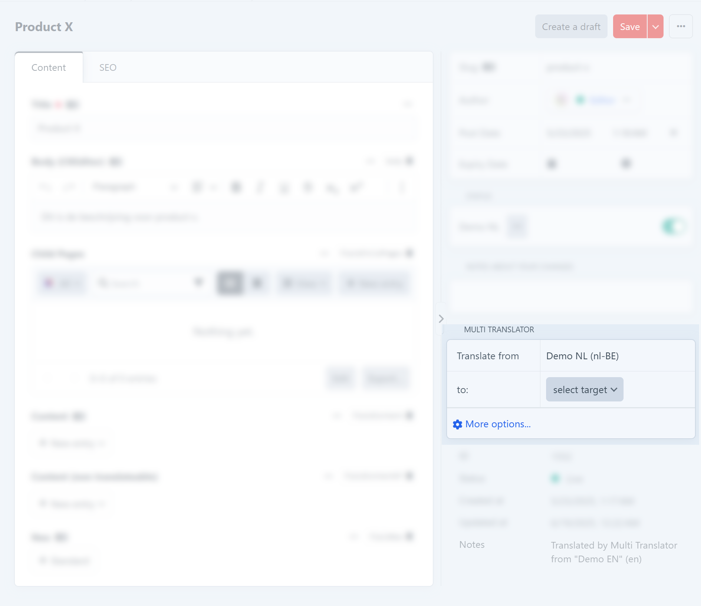

# Multi Translator

Translate your site content using Deepl, Google Translate or ChatGPT.

## Requirements

This plugin requires Craft CMS 4 or Craft CMS 5.

## Installation

You can install this plugin from the [Plugin Store](https://plugins.craftcms.com/multi-translator) or with Composer.

#### From the Plugin Store

Go to the Plugin Store in your project’s Control Panel and search for “Multi Translator”. Then press “Install”.

#### With Composer

Open your terminal and run the following commands:

```bash
composer require digitalpulsebe/craft-multi-translator -w && php craft plugin/install multi-translator
```

when using DDEV:

```bash
ddev composer require digitalpulsebe/craft-multi-translator -w && ddev exec php craft plugin/install multi-translator
```

## Translation Services

For now, we support these API services:

- Deepl - Create your account at [Deepl](https://www.deepl.com/nl/pro-api) to get an API Key
  - with support for [Glossaries](#manage-glossaries)
- Google Cloud Translation v2 - Create an API key in your [Cloud Console](https://console.cloud.google.com/)
- Google Cloud Translation v3 - Create a Service Account your [Cloud Console](https://console.cloud.google.com/iam-admin/serviceaccounts)
- OpenAI (ChatGPT) - Create an API key in at [OpenAI](https://platform.openai.com/)
  - also supports any [OpenAI-compatible endpoint](#openai-compatible-providers) (Azure OpenAI, Ollama, Groq, Mistral, Infomaniak AI Service, …)

### OpenAI-compatible providers

The **OpenAI API** provider supports a configurable base URL and custom model name, allowing you to point it at any OpenAI-compatible endpoint.

| Setting | Description | Default |
|---------|-------------|---------|
| **API Base URL** | Base URL of the API endpoint | `https://api.openai.com/v1` |
| **API model** | Model dropdown, or select "Custom" to enter a free-text model identifier | `gpt-4o` |
| **Custom model name** | Free-text model identifier (shown when "Custom" is selected) | — |

Both the base URL and model fields support Craft environment variables (e.g. `$OPENAI_BASE_URL`).

#### Example: Infomaniak AI Service

In your `.env`:

```bash
OPENAI_BASE_URL="https://api.infomaniak.com/2/ai/{product_id}/openai/v1"
OPENAI_API_KEY="your-infomaniak-api-token"
```

In the plugin settings: set Base URL to `$OPENAI_BASE_URL`, API Key to `$OPENAI_API_KEY`, select **Custom** as the model and enter e.g. `mistral3` or `qwen3`.

## Roadmap

Please let us know which API's and features are desired for this plugin!

## Plugin Settings

Configure options in the Craft control panel settings


## Permissions

For non-admin users, enable permissions under the 'Multi Translator' section:

- 'Manage settings'
  - this will allow CMS users to enter an API key an edit general settings
- 'Translate Content'
  - enables the element actions to [translate one-by-one](#translate-one-by-one)
- 'Translate Content in bulk (element action)'
  - enables the bulk actions to [translate one-by-one](#translate-in-bulk)

## Supported field types

- craft\fields\PlainText
- craft\fields\Table
- craft\redactor\Field
- craft\ckeditor\Field
- craft\fields\Link
- verbb\vizy\fields\VizyField
- craft\fields\Matrix (recursive)
- benf\neo\Field (recursive)
- verbb\supertable\fields\SuperTableField (recursive)
- verbb\hyper\fields\HyperField
- nystudio107\seomatic\fields\SeoSettings
- ether\seo\fields\SeoField

## Usage

There are two ways to trigger a translation.

### Translate one-by-one

1. Navigate to the entry on the desired source site/language.
2. Use the buttons in the sidebar and select the target language.

(you can reverse this flow by setting the default direction in the configuration)



### Translate in bulk

1. Navigate to overview of entries you want to get translated.
2. Select the entries in the source language.
3. Use the 'Translate to' dropdown in the actions bar and choose the target language
4. A queue job will be started


### Manage Glossaries

When using DeepL API, you can add a glossary for [supported language pairs](https://developers.deepl.com/docs/api-reference/glossaries).
When translating, the plugin will search a glossary for the appropriate source and target language.
There can only be **one glossary for each language pair**.


## Extending with events

You can add your own logic by listening to these events:

### The `beforeElementTranslation` event

Example:

```php
use digitalpulsebe\craftmultitranslator\events\ElementTranslationEvent;
use digitalpulsebe\craftmultitranslator\services\TranslateService;

Event::on(
    TranslateService::class,
    TranslateService::EVENT_BEFORE_ELEMENT_TRANSLATION,
    function (ElementTranslationEvent $event) {
        $sourceElement = $event->sourceElement;
        $sourceSite = $event->sourceSite;
        $targetSite = $event->targetSite;
    
        if ($sourceSite->handle == 'disabledSite') {
            $event->isValid = false; // cancel translation for this scenario
        }
    }
);
```

### The `afterElementTranslation` event

Example:

```php
use digitalpulsebe\craftmultitranslator\events\ElementTranslationEvent;
use digitalpulsebe\craftmultitranslator\services\TranslateService;
use digitalpulsebe\craftmultitranslator\MultiTranslator;

Event::on(
    TranslateService::class,
    TranslateService::EVENT_AFTER_ELEMENT_TRANSLATION,
    function (ElementTranslationEvent $event) {
        $event->targetElement->slug = MultiTranslator::getInstance()->translate->translateText(
            $event->sourceSite->language,
            $event->targetSite->language,
            $event->sourceElement->slug
        );
    }
);
```

### The `beforeFieldTranslation` event

Example:

```php
use digitalpulsebe\craftmultitranslator\events\FieldTranslationEvent;
use digitalpulsebe\craftmultitranslator\services\TranslateService;

Event::on(
    TranslateService::class,
    TranslateService::EVENT_BEFORE_FIELD_TRANSLATION,
    function (FieldTranslationEvent $event) {
        if ($event->field->handle == 'fieldTable') {
            $event->isValid = false; // cancel translation for this field
        }
    }
);
```

### The `afterFieldTranslation` event

Example:

```php
use digitalpulsebe\craftmultitranslator\events\FieldTranslationEvent;
use digitalpulsebe\craftmultitranslator\services\TranslateService;

Event::on(
    TranslateService::class,
    TranslateService::EVENT_AFTER_FIELD_TRANSLATION,
    function (FieldTranslationEvent $event) {
        if ($event->field->handle == 'body') {
            $event->translatedValue = 'CUSTOM VALUE';
        }
    }
);
```
